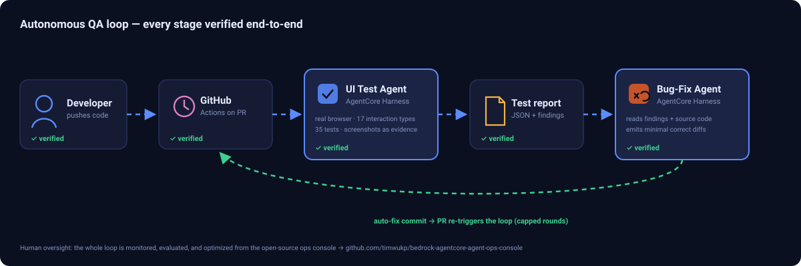
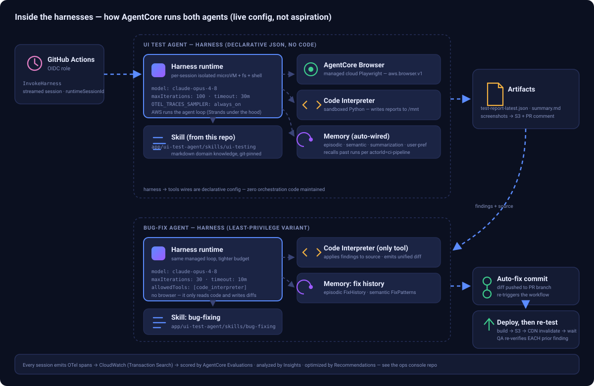

# AWS Bedrock AgentCore Harness — Best Practices & UI Test Agent

Production-ready AI agent that replaces human QA testers, built on **Amazon Bedrock AgentCore**.

[]()
[]()
[]()
[]()

> 🤖 **AI agents working on this repo:** read [`AGENTS.md`](AGENTS.md) first. It captures hard-learned facts about AWS Bedrock AgentCore (SDK versions, API gotchas, harness-vs-runtime distinction) so you don't have to re-discover them.

## What This Does

An AI agent that navigates web applications like a human QA tester — clicking buttons, filling forms, scrolling, hovering, dragging — then reports PASS/FAIL with evidence.

**Verified:** 35 tests | 33 PASS | 3 bugs detected (2 in our app + 1 in test target) | 17 interaction types | Browser + Code Interpreter working

### Interaction Types Tested

| Category | Interactions |
|----------|-------------|
| **Forms** | Login, submit, validation, error detection |
| **Selection** | Dropdown, checkbox toggle |
| **Dynamic** | Async loading wait, infinite scroll, add/remove elements |
| **Complex** | Drag-and-drop, hover, right-click context menu, keyboard input |
| **Navigation** | Redirect, iframe switching, page transitions |
| **Detection** | Broken images, CSS bugs, flaky UI, error messages |

## Architecture

**The loop** — every stage verified end-to-end:



**Inside the harnesses** — how AgentCore actually runs both agents (drawn from the live harness
configs, not aspiration): declarative JSON, managed agent loop, per-session microVMs, Browser /
Code Interpreter tools, auto-wired Memory strategies, and git-pinned Skills from this repo:



> The live demo harnesses currently run `global.anthropic.claude-opus-4-8`. The model is a
> one-line declarative config (`model.bedrockModelConfig.modelId`) — if you deploy your own copy,
> swap in any Bedrock model that fits your needs (Sonnet for lower latency/cost, Opus for maximum
> capability) via `UpdateHarness`, without touching CI or redeploying code.

The whole loop is monitored, evaluated, and optimized from the companion open-source
[**AgentCore Agent Ops Console**](https://github.com/timwukp/bedrock-agentcore-agent-ops-console).

| Stage | Status | Evidence |
|-------|--------|----------|
| CI/CD trigger (GitHub Actions) | ✅ Verified | PR triggers workflow, posts results as PR comment |
| Branch deploy inside the loop | ✅ Verified | Build (with env injection) → S3 → CloudFront invalidation before every QA round |
| UI Test Agent execution | ✅ Verified | Real browser, Cognito login, full-site exploration + cross-page value checks |
| Test Report generation | ✅ Verified | JSON reports + screenshots published to S3 by the pipeline |
| Bug detection on a real app | ✅ Verified | Found genuine, unseeded bugs (cost mismatches, missing pricing rows, duplicate table rows) |
| Bug-Fix Agent | ✅ Verified | Patched findings and pushed auto-fix commits that re-trigger the loop |
| Reconciliation (convergence) | ✅ Verified | Every prior finding re-verified each round: FIXED / STILL_FAILING table on the PR |

### Live demo — real bugs on a real production app

The loop runs against a deployed [Bedrock token-monitoring
app](https://github.com/timwukp/Claude-code-on-AWS-Bedrock-Token-monitoring-alarm-system)
(CloudFront + Cognito + API Gateway + Lambda) — not a toy page, and none of the bugs are seeded.
The QA agent explores the live site, cross-checks values across pages, and the Bug-Fix agent
patches what is genuinely patchable:

> Cost page claims "774% lower than without caching" — mathematically impossible (max saving is
> 100%; the denominator used final cost instead of pre-cache cost). Usage page shows \$0.00 while
> the Cost page shows \$288.93 for the same window. A model with 250M+ cache-read tokens prices
> at \$0.00 because its pricing row is missing.

Watch it run: **[PR #29](https://github.com/timwukp/Claude-code-on-AWS-Bedrock-Token-monitoring-alarm-system/pull/29)**
— the full history of the loop converging (auto-fix rounds, a deploy-path gap discovered the hard
way, reconciliation tables in the PR comments). The loop's exits are goal-driven: green when no
blocking findings remain, early red when two consecutive rounds make zero progress (a finding the
repo can't fix — data/env issues — is a human's job), with a round cap only as a runaway fuse.

Built with:
- **AgentCore Browser** — remote cloud Playwright (click, type, screenshot)
- **AgentCore Code Interpreter** — sandboxed Python for analysis
- **AgentCore Memory** — learns from past tests (semantic + episodic)
- **Strands Agents SDK** — agent framework
- **AgentCore CLI** — deployment tooling

## Deployment Modes

| | Runtime (Code-based) | Harness (Declarative) |
|---|---|---|
| **You write** | Python code (agent loop, tool wiring, memory integration) | A JSON config (model, tools, prompt) |
| **Who manages orchestration** | You (Strands/LangChain/custom) | AWS (Strands under the hood) |
| **Model switching** | Change code + redeploy | Change config, or override per-invoke — no redeploy |
| **Multi-provider** | You integrate yourself | Built-in: Bedrock + OpenAI + Gemini, switch mid-session |
| **Shell access** | Your own container | Each session gets isolated microVM + filesystem + shell |
| **Tool connection** | Write code to wire tools | Declarative: list MCP URLs / Gateway ARNs / Browser / Code Interpreter |
| **Memory** | Manually integrate via SDK | Automatic: attach Memory ARN, auto-save/retrieve per invoke |
| **Per-invocation override** | Not supported (deploy = fixed) | Override model, tools, prompt, limits on each invoke call |
| **Skills** | Not supported | Attach markdown bundles for domain knowledge |
| **Observability** | Wire OpenTelemetry yourself | Automatic tracing on every action |
| **Deployment** | Package code → upload → create Runtime | One API call (`create_harness`) |
| **Console location** | AgentCore → Runtimes | AgentCore → Harness (Preview) |

**When the difference matters most:**
- **Rapid experimentation** — Harness lets you swap models/prompts per invoke without redeploying
- **Multi-model comparison** — Harness switches providers mid-session (Bedrock → OpenAI); Runtime cannot
- **Operations** — Harness = zero code maintenance; Runtime = maintain main.py + deps + container

```bash
# Mode 1: Runtime (full control, write your own agent)
agentcore deploy

# Mode 2: Harness (zero code, declarative config)
python app/ui-test-agent/deploy_harness.py --role-arn <EXECUTION_ROLE_ARN>
```

See [Design Document — Deployment Modes](docs/DESIGN_UI_TEST_AGENT.md#deployment-modes) for full details.

## Quick Start

```bash
# Install CLI
npm install -g @aws/agentcore

# Deploy
cd app/ui-test-agent && ./deploy.sh

# Run locally with browser
pip install bedrock-agentcore strands-agents strands-agents-tools playwright
python -c "
from strands import Agent
from strands_tools.browser import AgentCoreBrowser

agent = Agent(tools=[AgentCoreBrowser(region='us-east-1').browser])
agent('Test login at https://the-internet.herokuapp.com/login. Type tomsmith/SuperSecretPassword!, click Login, verify redirect.')
"
```

## Project Structure

```
├── AGENTS.md                # ⭐ Read first if you're an AI agent contributing to this repo
├── app/ui-test-agent/
│   ├── main.py              # Agent (Browser + Code Interpreter + Memory)
│   ├── invoke.py            # Orchestrator (boto3 streaming + inline functions)
│   ├── eval_runner.py       # 6 golden tests for agent validation
│   ├── a2a_handoff.py       # Agent-to-Agent protocol (→ Bug-Fix Agent)
│   ├── harness.json         # Harness declarative config
│   ├── test_config.json     # Test suite definitions (smoke + regression)
│   └── skills/ui-testing/   # Domain knowledge
├── docs/
│   ├── ARCHITECTURE.md      # Full system design (900+ lines)
│   ├── BEST_PRACTICES.md    # AgentCore Harness best practices (EN)
│   ├── BEST_PRACTICES_zh-TW.md  # 中文版
│   ├── TEST_RESULTS.md      # All test run results
│   ├── TESTING_THE_AGENT.md # How to test the agent itself
│   ├── BUG_FIX_AGENT.md    # Downstream auto-fix agent design
│   ├── ADMIN_PORTAL.md     # Admin dashboard design
│   └── TRIGGERS.md         # CI/CD, scheduled, webhook, manual triggers
├── .github/workflows/
│   └── ui-test.yml          # GitHub Actions: PR → test → comment
└── agentcore/               # AgentCore deployment config (CDK)
```

## Documentation

| Document | Description |
|----------|-------------|
| [AGENTS.md](AGENTS.md) | ⭐ Quick orientation for AI agents (SDK versions, API gotchas, methodology) — read first |
| [Best Practices](docs/BEST_PRACTICES.md) | When to use Harness, architecture decisions, 34/34 features utilized |
| [Architecture](docs/ARCHITECTURE.md) | End-to-end system design, guardrails, self-learning, scaling, cost |
| [Test Results](docs/TEST_RESULTS.md) | 8 test runs, 32 cases, evidence for every result |
| [Testing the Agent](docs/TESTING_THE_AGENT.md) | Golden tests, eval framework, the-internet.herokuapp.com |
| [Bug-Fix Agent](docs/BUG_FIX_AGENT.md) | Downstream agent that auto-fixes detected bugs |
| [Admin Portal](docs/ADMIN_PORTAL.md) | Dashboard for managing test suites and viewing reports |
| [Triggers](docs/TRIGGERS.md) | 4 trigger mechanisms (CI/CD, portal, scheduled, webhook) |
| [Development Workflow](docs/DEVELOPMENT_WORKFLOW.md) | Issue → fix → PR methodology for contributors |
| [Production Hardening](docs/PRODUCTION_HARDENING.md) | Design playbook for Container deploy, S3 recording, profiles, Web Bot Auth, CloudWatch alarms, online eval |

## Related projects

- **[agentcore-harness-builder](https://github.com/timwukp/agent-skills-best-practice/tree/main/skills/skills/agentcore-harness-builder)** — the open-source Kiro skill that captures the hard-won methodology used to build this repo, packaged for any agent (Kiro / Claude Code / Claude.ai) to drive a Harness build end-to-end. Battle-tested by building a second use case ([Quick POC UI agent](#)) against real AWS. Released as `v0.1.0` on 2026-06-14: <https://github.com/timwukp/agent-skills-best-practice/releases/tag/v0.1.0>.


## Cost

~$0.32 per test suite (5-10 cases). See [cost estimation](docs/ARCHITECTURE.md#entire-project-cost-estimation).

## License

Apache-2.0
